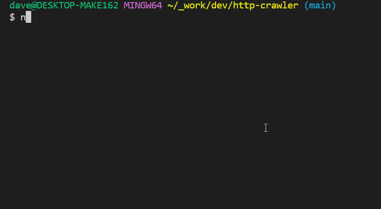

# Recursive Site Crawler

# Preview



# Features

- given a base URL, collects all `anchor` elements on pages of content `text/html` 
- produces JSON of visited URLs and the number of references to each URL in a format like the below:
- works with HTTP and HTTPS
- handles malformed URLs
- unit tests available at src/tests (jest)

```json
[
    {
        "url": "https://example.com",
        "visits": 10,
    },
    {
        "url": "https://example.com/blog",
        "visits": 4,
    },
    {
        "url": "https://example.com/about",
        "visits": 1,
    },
]
```

# Technologies
- NodeJS
- TS-node
- TypeScript (type checking)
- Express (API-functionality)
- Babel (transpilation)
- Jest (unit tests)

# Usage
usage 

### Standalone (results to console)
```
$ npm run crawl [website]
```
### Api server: 
```
$ npm run start
```
### Tests: 
```
$ npm run test
```
### Build dist:
```
$ npm run build
```
### Develop Locally:
```
$ npm run dev
```
# Implementation

The core functionality of the app is built around 3 main functions:

1. `crawl`

`crawl` takes in a base URL and a starts with empty object which holds all the URLs that the function finds. It does several higher level tasks:

- Ensures that we are crawling within the limits of a page (`limit: number` is a parameter with a fairly low default; this is to prevent accidentally DDOSing a site)
- Ensures that we are not crawling external sites 
- Calls a helper function, `getURLsFromHTML` if an anchor element results in a `content-type` of `text/html`, and iterates through the list of URLs returned from `getURLsFromHTML`.

2. `normalizeURL`

`normalizeURL` takes in a URL and cleanses it before data is aggregated. Cleansing refers to removing trailing slashes so the aggregator doesn't count hostnames with trailing slashes as separate paths (https://google.ca/ => https://google.ca)

3. `getURLsFromHTML`

`getURLsFromHTML` is a helper function that simply collects all `<a>` elements and returns them in an array. It includes validation logic to understand whether an anchor element is a relative or an absolute URL.

# Struggles

A big struggle I had was running into unexpected unit test behavior. Given an invalid URL, the `URL` constructor that Node provides will throw a TypeError [according to the documentation](https://nodejs.org/api/url.html).

```ts
test("getURLsFromHTML skip invalid URL", () => {
    const htmlBody: string = `
<html>
    <body>
    <a href="invalid">
        No slash or protocol - broken link
    </a>
    </body>
</html>
`
    const inputBaseURL = "https://blog.msoup.com"
    const actual = getURLsFromHTML(htmlBody, inputBaseURL)
    const expected: [] = []
    expect(actual).toEqual(expected)
})
```

While the test passed, the code took a completely different turn when ran through Jest, like so:

```ts
try {
        const url = new URL(`${link.href}`)
        urls.push(url.href)
    }
catch (err: unknown) {
    if (err instanceof TypeError) {
        // path TypeError: this is the expected path
        continue
    }
    else {
        // path Other: this is what happens only through Jest
        continue
    }
}

```

Upon digging, I discovered that the root issue was from [Jest having completely different globals from Node globals](https://github.com/facebook/jest/issues/2549). This has been a long standing issue from as early as January 2017.

The take-away is that as of 2023, using `someArray instanceof Array` and when using http, `someError instanceof Error` will inevitably return `false`, even if everything else seems to suggest that it is `true`. This hasn't been patched because Jest ensures that every test runs in its own sandbox.

In the case of `arrays`, we can simply move to using `Array.isArray` as a band-aid fix, but `Error.isError` is not a function. 

As a temporary fix, I have made the paths the same whether `err instanceof TypeError` is true or not.

# TODO

I hope to extend this project so it becomes a callable API, not a stand alone module to be run locally.